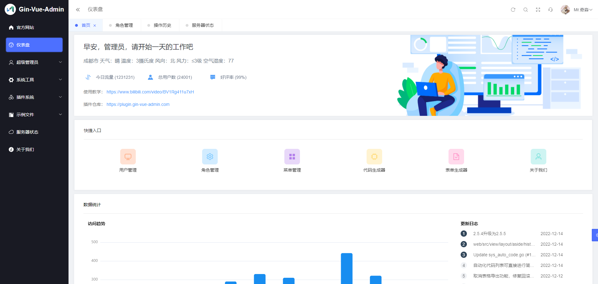
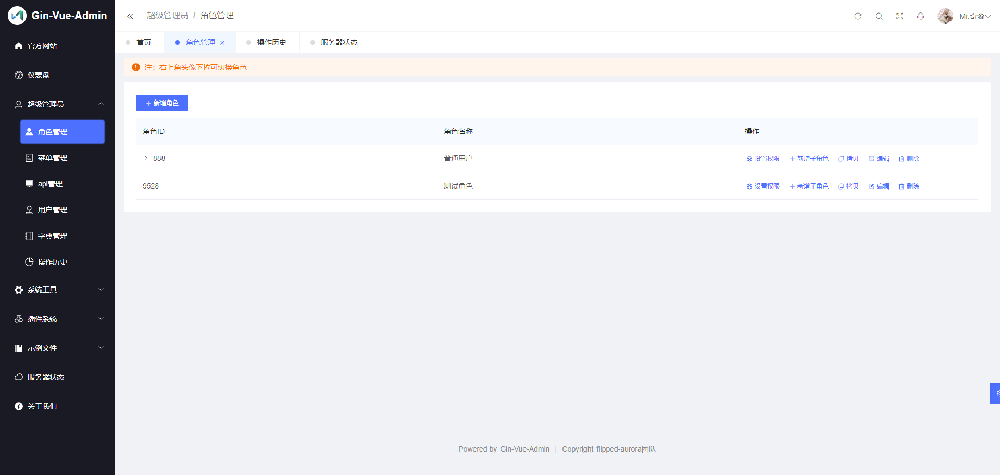
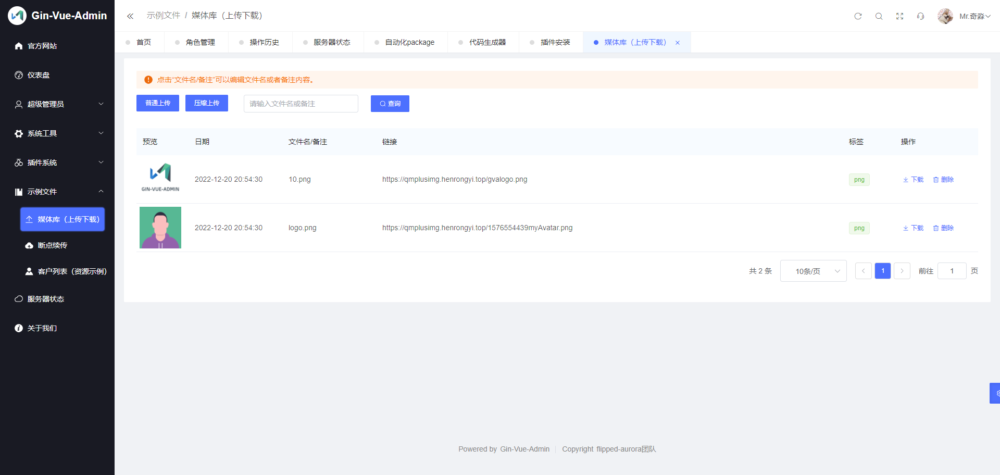
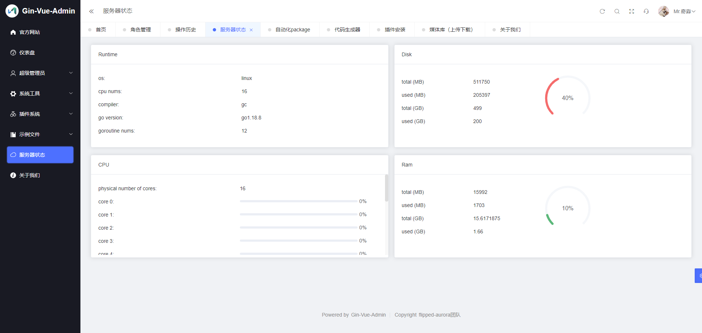

# gin-vue-admin(gva) 项目学习


```
Something I hope you know before go into the coding~
First, please watch or star this repo, I'll be more happy if you follow me.
Bug report, questions and discussion are welcome, you can post an issue or pull a request.
```

**本仓库仅学习玩耍之用，请务必遵守官方开源协议，切莫以身试法**

## 相关站点

* 官方源码：<https://github.com/flipped-aurora/gin-vue-admin>
* 官方文档：<https://www.gin-vue-admin.com>

## 目录

* [gva介绍](docs/gva介绍.md)
* [gva容器化部署](docs/gva容器化部署.md)
    * [gva容器化部署-rocky8.6](docs/gva容器化部署-rocky8.6.md)
* [gva使用](docs/gva使用.md)
    * [如何运行gva](docs/gva使用/如何运行gva.md)
    * [如何创建一个前端页面](docs/gva使用/如何创建一个前端页面.md)
    * [如何创建一个二级菜单](docs/gva使用/如何创建一个二级菜单.md)
    * [如何创建一个后端api](docs/gva使用/如何创建一个后端api.md)
    * [如何创建一个角色](docs/gva使用/如何创建一个角色.md)
* [gva源码分析](docs/gva源码分析.md)


## 图示










---
