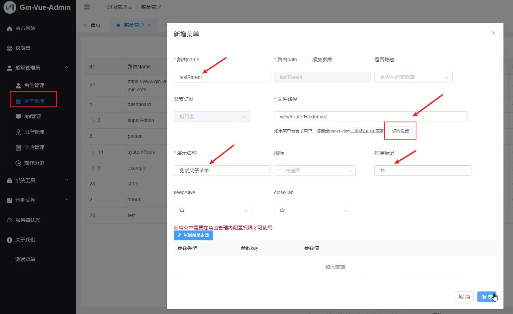
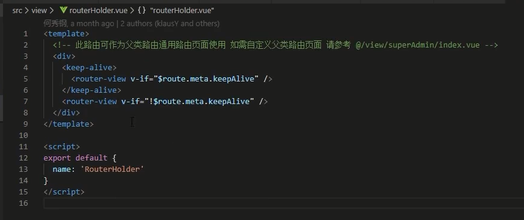
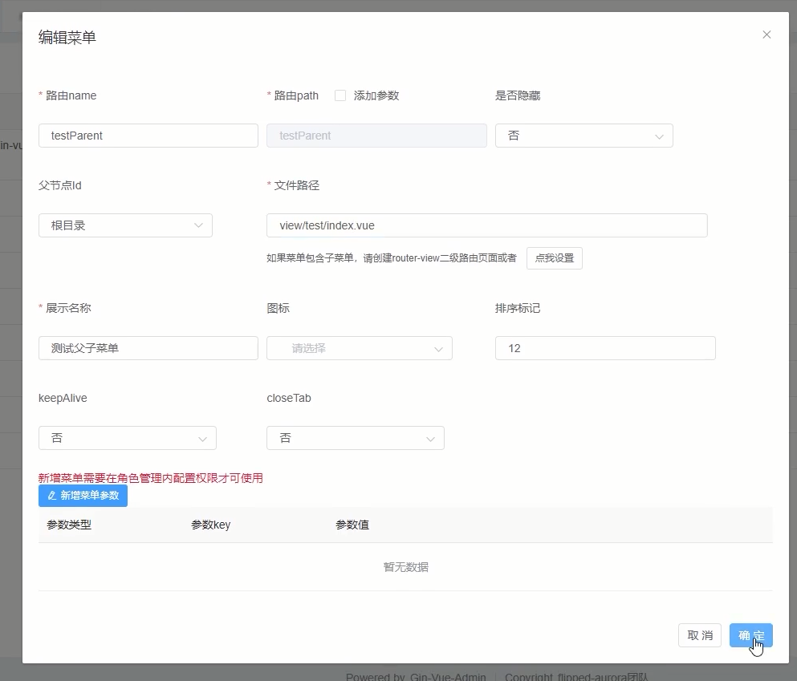
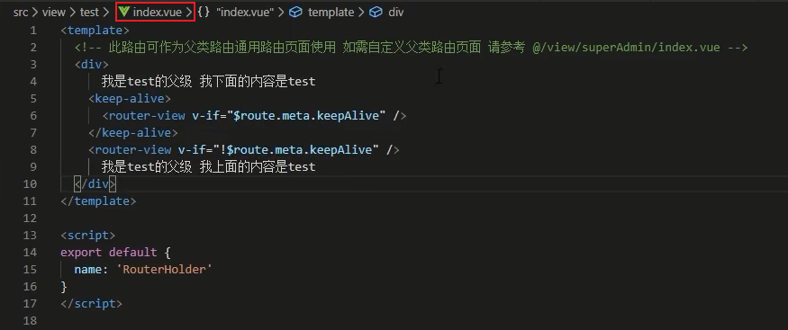
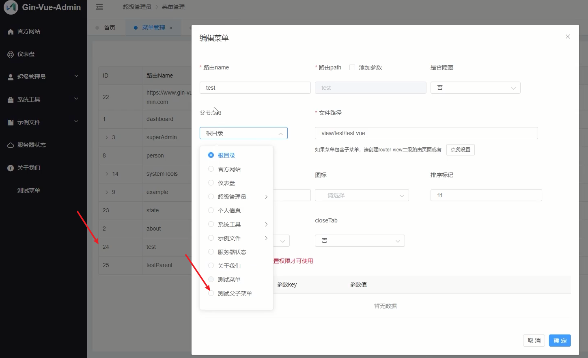
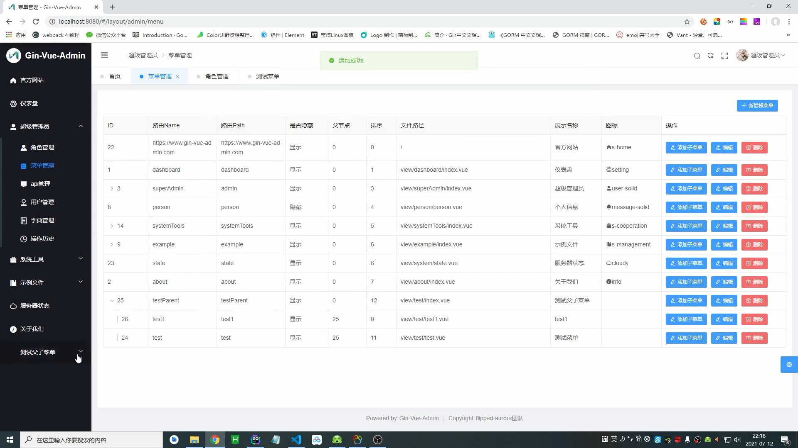
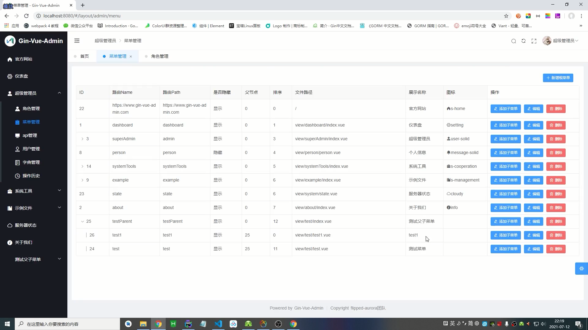
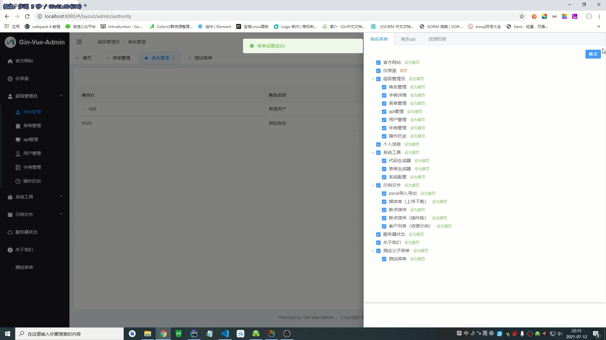
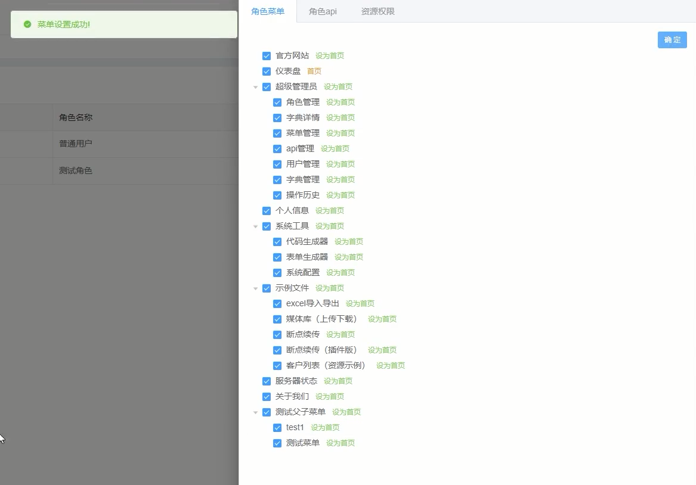
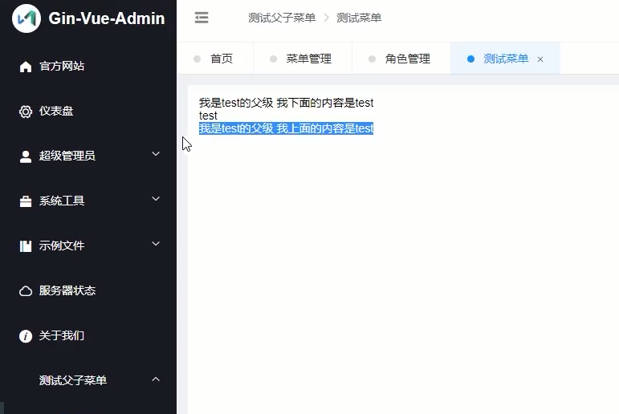

<!-- MDTOC maxdepth:6 firsth1:1 numbering:0 flatten:0 bullets:1 updateOnSave:1 -->

- [如何创建一个二级菜单](#如何创建一个二级菜单)   
   - [创建vue页面](#创建vue页面)   
   - [菜单管理中添加页面](#菜单管理中添加页面)   
   - [角色管理添加页面权限](#角色管理添加页面权限)   

<!-- /MDTOC -->
# 如何创建一个二级菜单

## 创建vue页面

主菜单页面

可选默认主菜单vue，也可以自己创建自定义主菜单vue

默认主菜单vue：

创建自定义主菜单vue:

## 菜单管理中添加页面

默认主菜单vue：

创建自定义主菜单vue:

## 角色管理添加页面权限

默认主菜单vue：

创建自定义主菜单vue:

---
