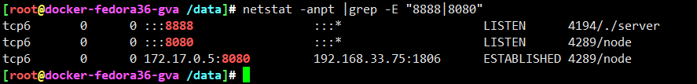
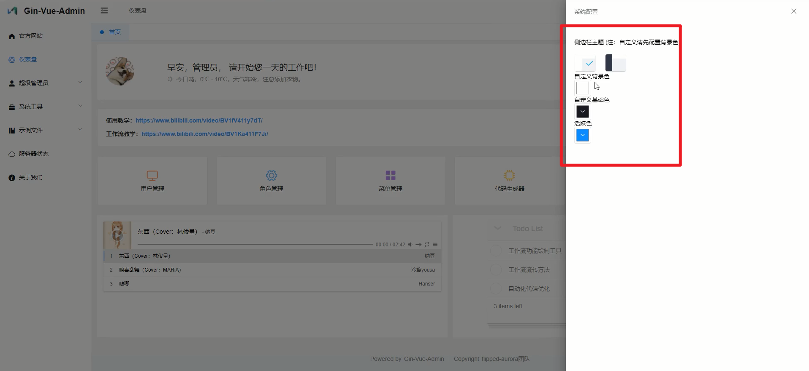
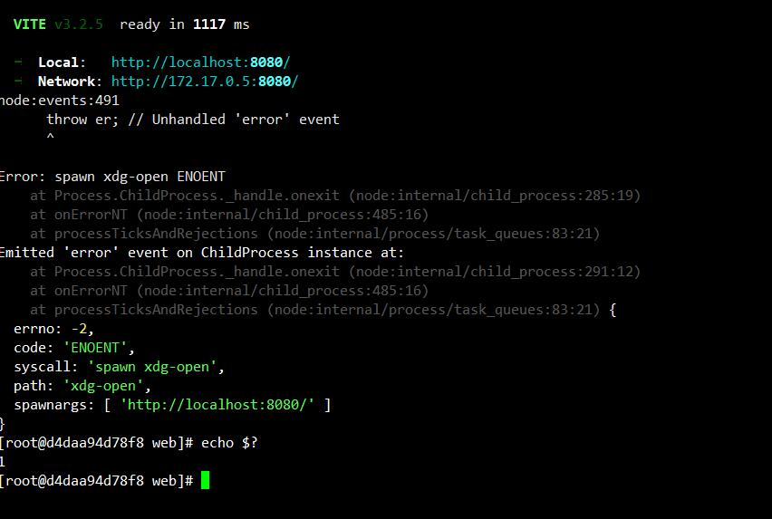

<!-- MDTOC maxdepth:6 firsth1:1 numbering:0 flatten:0 bullets:1 updateOnSave:1 -->

- [如何运行gva](#如何运行gva)   
   - [源代码获取](#源代码获取)   
   - [依赖安装、基本配置](#依赖安装、基本配置)   
   - [server端编译运行](#server端编译运行)   
   - [web前端编译运行](#web前端编译运行)   
   - [状态查看](#状态查看)   
   - [登陆使用](#登陆使用)   
   - [常见问题](#常见问题)   
      - [spawn xdg-open ENOENT](#spawn-xdg-open-enoent)   

<!-- /MDTOC -->

# 如何运行gva

## 源代码获取

```
git clone https://github.com/flipped-aurora/gin-vue-admin
```

## 依赖安装、基本配置

```
dnf install -y \
    redis \
    nginx \
    go \
    git \
    spawn \
    xdg-utils \
    hostname \
    npm \
    community-mysql \
    community-mysql-server

go env -w GO111MODULE=on
go env -w GOPROXY=https://goproxy.cn,direct

npm config set registry https://registry.npm.taobao.org

npm install -g yarn

systemctl enable --now mysqld
mysql -uroot -e "CREATE DATABASE gva default charset 'utf8' collate 'utf8_bin'; GRANT ALL PRIVILEGES ON * . * TO 'root'@'localhost'; ALTER USER 'root'@'localhost' IDENTIFIED WITH mysql_native_password BY 'gva123';flush privileges;"

systemctl enable --now redis
```

## server端编译运行

启动一个tmux会话，将运行程序放在后端运行

```
tmux new-session -d -s gva -n bash '/bin/bash'
```


```
cd /opt/gva/server && go generate && go build -o server main.go

tmux new-window -n server -t gva: '/usr/bin/bash -c "/usr/bin/cd /opt/gva/server && ./server"'
```


## web前端编译运行

```
cd /opt/gva/web/ && npm install
tmux new-window -n web -t gva: '/usr/bin/bash -c "/usr/bin/cd /opt/gva/web && /usr/bin/npm run serve"'
```


## 状态查看

* api server监听8888
* 前端node监听8080



* 调试、开发这么玩，线上部署得上nginx，毫无疑问


## 登陆使用

首次登陆需要初始化，配置数据库


* <https://www.gin-vue-admin.com/guide/start-quickly/initialization.html>





## 常见问题


### spawn xdg-open ENOENT



解决方法：

```
yum install -y xdg-utils spawn
```


---
